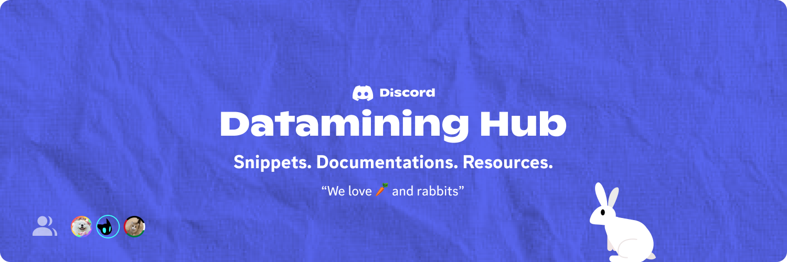

# 🐰 DISCORD DATAMINING WIKI & RESOURCES

- Here you can find the basics of `findByProps`, `discord webpack`, and __other mechanics__ to get started on Datamining. Contributions such as <kbd>[Pull Requests](https://github.com/FoUnDeRR/datamining-hub/pulls)</kbd> are welcomed, but make sure it is worth considering.

> [!IMPORTANT]
> This is a small project I thought to start for people who don't know about **Datamining**. So nothing serious.

---

### Table of Content

- [Getting Started](#getting-started)
- [Basics of the Basics](#basics-of-the-basics)
- [Guides](#guides-and-breakdowns)

---

## Getting started

### Prerequisites

1. A good knowledge about JavaScript
2. Familiarility with [findByProps](src/util/utils.js), functions, modules, strings, experiments

### Basics of the Basics

> `CTRL + SHIFT + I` to open Chrome Developer Tools, or since it's Discord, **DevTools**.
> As the start, we only do stuff in the `Console` tab.

> [!WARNING] 
> **DO NOT** try to do experiments in your stable Discord client unless you know what you are doing. There are many chances that you will either break your client or get your account disabled. Instead, use [Discord Public Test Build](https://ptb.discord.com/download) or [Discord Canary Build](https://canary.discord.com/download)

### Guides and Breakdowns
- Functions - can be found from [here](info/functions)
- More guides are on it's way here!

